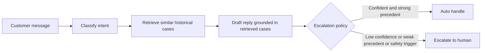
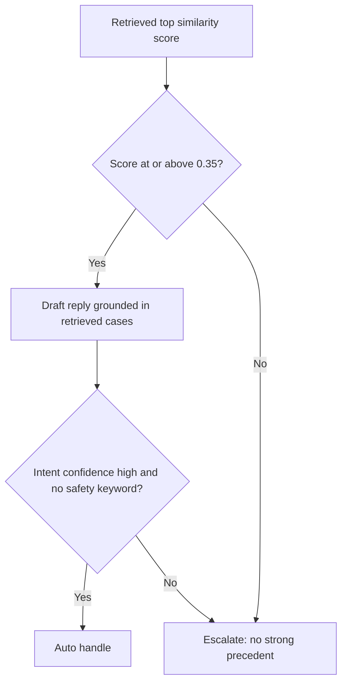
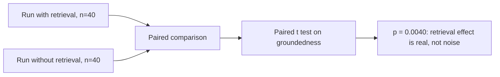
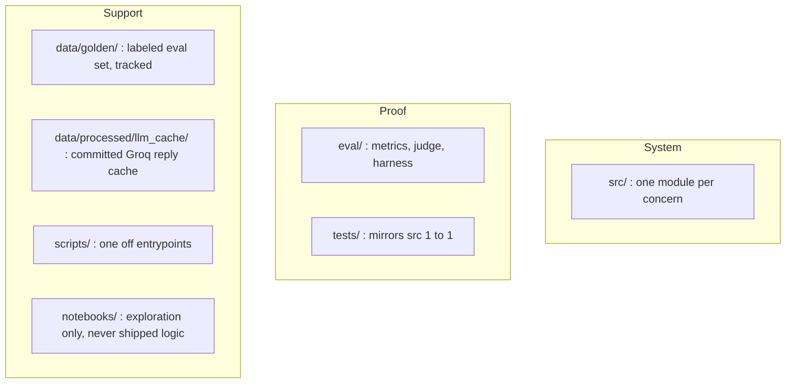

# Hiver Support Agent

A take home project building a grounded customer support agent over the
Kaggle Customer Support on Twitter dump, focused on AppleSupport. The system
classifies an incoming message into an intent, retrieves similar historical
cases, drafts a reply grounded in those cases, and decides whether to auto
handle or escalate to a human, with a stated reason.

Write up: [`REPORT.md`](REPORT.md). Decisions: [`DECISION_LOG.md`](DECISION_LOG.md).
Plan: [`PHASE_PLAN.md`](PHASE_PLAN.md).

## Pipeline overview



Each stage is a separate module with a single responsibility. The orchestration
layer (`pipeline.py`) only calls these modules in sequence and contains no
business logic of its own.

## Reproduce in under fifteen minutes

Headline numbers in `eval/eval_results.md` and `REPORT.md` are already written
from a completed Groq run, so an API key is not required to read them. The
steps below prove the code runs. Regenerating LLM replies is optional
verification, not a requirement for reviewing results.

### Offline path (no API key, guaranteed under fifteen minutes)

```bash
python3 -m venv .venv
source .venv/bin/activate
pip install -r requirements.txt

# Raw dump is gitignored. This script skips the download if
# data/raw/twcs.csv already exists.
python scripts/fetch_raw_data.py

# The golden set is already tracked under data/golden/, so this
# regeneration step is optional.
# PYTHONPATH=. python scripts/build_golden_set.py

PYTHONPATH=. pytest -q
PYTHONPATH=. python eval/run_eval.py --draft template
PYTHONPATH=. python scripts/run_pipeline_cli.py "my iPhone battery drains after the update"
```

Expected output: pytest passes, `eval/eval_results.md` is rewritten for the
template arm, and the CLI prints a JSON pipeline result. A timed fresh venv
run takes about two to three minutes once the raw CSV is cached. A cold Kaggle
download adds a few minutes the first time, still comfortably under the
fifteen minute budget.

### Optional Groq path (about four to five minutes): real reply generation and ablation

This path requires a `GROQ_API_KEY` in a local `.env` file (see
`.env.example`), but only if you want fresh API calls. You can skip this block
entirely if you have no key. The headline numbers from this run are already
saved in `eval/eval_results.md` and `REPORT.md`.

This repo also ships a committed cache under `data/processed/llm_cache/`
(about eighty JSON replies from the n equals forty evaluation). With caching
on, which is the default, `--draft llm` replays those responses without
calling Groq and without needing a key at all. Use `--no-cache` only if you
have your own key and want a live re-check.

Default concurrency is three workers. Groq's free tier allows roughly eight
thousand tokens per minute, and higher worker counts tend to trigger 429 rate
limit errors.

```bash
# Replays from the committed cache if available, otherwise calls Groq live
PYTHONPATH=. python eval/run_eval.py --draft llm --reply-sample 40 --workers 3

# Forces fresh Groq calls, requires GROQ_API_KEY
PYTHONPATH=. python eval/run_eval.py --draft llm --reply-sample 40 --workers 3 --no-cache

# Full golden set with both ablation arms, slower, needs a key for any cache miss
PYTHONPATH=. python eval/run_eval.py --draft llm --reply-sample 0 --workers 3
```

## Results summary

Numbers below come from the most recent `eval/run_eval.py --draft llm
--reply-sample 40` run, recorded in `eval/eval_results.md`. Routing metrics
use the full golden set of two hundred examples with template drafts. Reply
quality and ablation metrics use a Groq sample of forty examples, because a
full two hundred by two LLM pass is painful to re run repeatedly on a free
tier rate limit.

| Metric | Value | Sample size |
|---|---|---|
| Intent accuracy | 100.0% | n = 200 |
| Escalation precision and recall | 42.5% and 100.0% | n = 200 |
| Escalation false negatives | 0 | n = 200 |
| Escalation false positives | 103, median top similarity 0.207 among them | n = 200 |
| Groundedness with retrieval | 3.60 | n = 40, Groq |
| Groundedness without retrieval | 3.23 | n = 40, ablation |
| Ablation significance | p = 0.0040, paired t test | n = 40 |
| Judge to human agreement (kappa) | 1.000, checklist consistency, not true inter annotator agreement | n = 30 |

| Approach | Intent accuracy | Escalation precision and recall |
|---|---|---|
| Trivial (majority intent, never escalate) | 12.5% | 0.0% and 0.0% |
| Simple (TF-IDF plus logistic regression, safety keyword escalation) | 100.0%* | 100.0% and 2.6% |
| This system | 100.0%* | 42.5% and 100.0% |

\*Intent accuracy of one hundred percent is not a held out generalization
result. The golden labels and the keyword classifier share the same taxonomy,
and the simple baseline is fit in sample on that same golden file. Treat both
of these cells as consistency checks rather than fair comparisons. The full
table, per arm rubric scores, and reproduction commands are in
`eval/eval_results.md` and `REPORT.md`.

## Trade offs

For AppleSupport, good does not mean maximum automation. It means never
inventing a fix when there is no usable historical precedent to ground it in.
The escalation gate, set at a similarity threshold of 0.35, is biased toward
handing off uncertain cases to a human.



This produces zero false negatives on the golden set, but a false positive
rate of 51.5%, meaning only about 10.5% of messages are auto handled. That is
a deliberate trust over automation choice, not a balanced triage scoreboard.

Reply scoring is capped at forty real Groq drafts for cost and rate limit
reasons. Intent and escalation still run on the full two hundred rows because
they need no LLM call. The default judge is heuristic, meaning it is rule
based rather than a second LLM call, so evaluation stays cheap to re run. The
cost of that choice is false negatives on replies that are actually good but
do not lexically echo a thin retrieved direct message stub, which is discussed
in the failure analysis in `REPORT.md`. Intent classification uses keyword
cues rather than an LLM classifier for the same reason: there are only eight
separable labels, the logic is testable offline, and the decision boundary is
something a reviewer can read line by line.

## Beyond the base spec

The assignment asks for a system plus proof, and the additional work here is
mostly on the proof side.

Retrieval is validated with a paired t test on groundedness, giving p equals
0.0040, rather than two averages compared by eye. High similarity neighbors
move groundedness more than low similarity ones (an increase of about 0.83
when top similarity is at or above 0.35, versus about 0.29 below that), which
is the empirical reason the escalation threshold sits at 0.35 rather than a
round guess.



Completions are cached to disk under `data/processed/llm_cache/`, which is
committed to the repository, so a reviewer can replay `--draft llm` without
needing their own API key, and local re runs do not burn quota unnecessarily.
Retries are capped and a shared request interval limiter keeps concurrent
workers from hanging for twenty minutes against an exhausted free tier quota.

The failure write up separates two tracks: reply quality on the Groq path,
and routing on the template path, since they stress different components. The
false positive pile was traced to a thin retrieval index, with a median
similarity of 0.207 among false positives and most of that mass well below
0.35, so the recommended next fix is expanding index coverage and cleaning
direct message stubs, not lowering the threshold.

## Key technical decisions

| Decision | Reasoning |
|---|---|
| Brand chosen: AppleSupport | High volume, mostly English traffic, substantive outbound replies rather than only "please DM us." See `DECISION_LOG.md`, Phase 0. |
| Eight intents derived from keyword clusters | Lifted directly from the AppleSupport data slice rather than imported from an unrelated taxonomy. |
| Escalation similarity gate set at 0.35 | Matches the point in the ablation data where retrieval actually starts helping groundedness. |
| Escalation implemented as a pure function | Produces an inspectable reason string, makes no LLM call, and holds no hidden state. |
| Groq model, openai/gpt-oss-20b | Free tier access, fast enough for a forty row concurrent sample, single client wrapper. |
| Worker count set to three | Higher concurrency triggered 429 errors against an approximately eight thousand token per minute free tier limit. |
| Sparse TF-IDF retrieval instead of dense embeddings | Offline and auditable. Track B of the failure analysis shows coverage, not ranking sophistication, is the actual bottleneck. |
| Index built from about two thousand outbound AppleSupport rows | The full twcs.csv file has about three million lines, filtered to the chosen brand and then sampled to fit the fifteen minute reproduction budget. |
| Golden labels assigned with the same keyword protocol as the classifier | Faster and more reproducible, but explicitly caveated as leaky and in sample in `REPORT.md`. |
| Heuristic judge used by default | Repeatable without a second API call per row. An LLM based judge remains available as an option. |

The longer decision trail, including what was rejected and why, is in
`DECISION_LOG.md`.

## What this does not cover

See the "What I chose not to build" section of `REPORT.md` for the full
deferred list: an LLM based intent classifier, dense retrieval, a full n
equals two hundred LLM evaluation, true multi rater inter annotator
agreement, held out intent labels, and production hardening such as auth,
queueing, and personally identifiable information redaction.

## Repository layout



| Path | Role |
|---|---|
| `src/` | The system itself, one concern per module |
| `eval/` | The proof: metrics, judge, and evaluation harness |
| `tests/` | Mirrors `src/` one to one |
| `scripts/` | One off entrypoints |
| `notebooks/` | Exploration only, never shipped logic |
| `data/golden/` | Protocol labeled evaluation set, tracked in git |
| `data/processed/llm_cache/` | Committed Groq reply cache enabling key free LLM replay |
