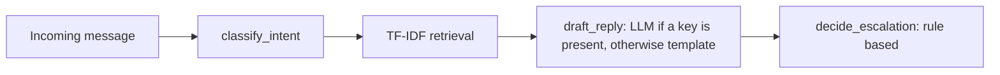
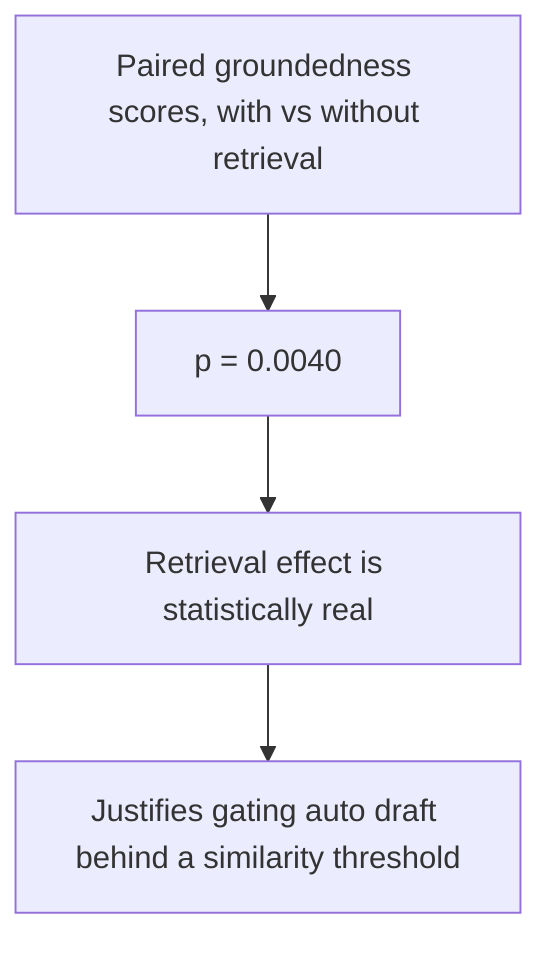
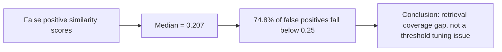

# Report: Hiver Support Agent for AppleSupport

## Framing

This take home builds a defensible, test driven support agent over the Kaggle
Customer Support on Twitter dump, sliced down to AppleSupport.

For this brand, good does not mean the maximum automation rate. Historical
AppleSupport traffic is full of thin direct message redirects and short
tweets, and inventing recovery steps or account advice without a close
precedent is worse than escalating to a human. So the bar set here is:
classify into a small taxonomy, ground a draft reply on real neighboring
cases when similarity is usable, and otherwise hand off to a human with an
explicit stated reason. Explainability under live questioning matters more
than a single leaderboard number. Thresholds live only in `config.py`,
escalation is implemented as a pure function, and `eval/run_eval.py` rebuilds
the entire headline table with one command.

The orchestration layer in `pipeline.py` only calls these four stages in
sequence and contains no business logic of its own. The brand choice and
rejected alternatives are documented in `DECISION_LOG.md`, Phase 0.

## What I chose not to build

An LLM based intent classifier was not built. Keyword cues stay offline and
inspectable across eight labels, which is enough given how separable those
labels are.

Dense or learned retrieval was not built. TF-IDF is sufficient to show that
retrieval coverage, not ranking quality, is the actual bottleneck.

A full n equals two hundred by two Groq reply evaluation on every iteration
was not run, because of token per minute limits and cost. Forty examples is
the reported reply sample.

True multi rater inter annotator agreement on the judge was not established.
The reported kappa is checklist consistency against the heuristic judge, not
independent human agreement.

Held out intent labels, blind to the keyword function, were not created. The
golden set's intents share the classifier's own taxonomy, which is called out
explicitly as a leak.

Production hardening was not built: authentication, request queueing,
personally identifiable information redaction, and multi brand routing are
all out of scope.

These are "one more week" items, not missing stubs inside the shipped path.

## Headline numbers

These come from `eval/eval_results.md`. There are two different sample sizes
here, and they should never be mixed. Intent and escalation metrics use n
equals two hundred with template drafts. Reply quality and ablation metrics
use n equals forty with real Groq calls under `--draft llm`, limited by free
tier token throughput.

Reproduce the LLM path with:
`PYTHONPATH=. python eval/run_eval.py --draft llm --reply-sample 40 --workers 3`

| System | Intent accuracy (n = 200) | Escalation precision | Escalation recall | Judge mean (n = 40) |
|---|---|---|---|---|
| Trivial baseline | 12.5% | 0% | 0% | not applicable |
| Simple baseline (TF-IDF plus logistic regression) | 100%\* | 100% | 2.6% | not applicable |
| Full system, with retrieval | 100%\* | 42.5% | 100% | 4.24 |

### The finding that actually justifies the architecture

On the forty row Groq reply sample, retrieval helps most when the neighbor is
strong.

| Similarity bucket | n | Mean groundedness change, with minus without |
|---|---|---|
| Top similarity at or above 0.35 | 6 | plus 0.83 |
| Top similarity below 0.35 | 34 | plus 0.29 |

Among rows where retrieval actually helped, meaning delta greater than zero,
there were fourteen out of forty, and their mean top similarity was 0.36,
compared to an overall mean top similarity of 0.29. Across the full paired
ablation, groundedness moved from 3.60 to 3.23, with a p value of 0.0040
(`eval/eval_results.md`).

That is the evidence that retrieval grounded generation is doing real work,
and it directly justifies gating auto drafting behind a similarity threshold:
do not auto draft when there is no usable precedent. The cost of that gate is
precision, discussed in Track B below.

The retrieval ablation table and the heuristic judge's caveats live in full
in `eval/eval_results.md`. The judge used is heuristic, not an LLM acting as
judge.

## What is misleading about the headline numbers

**Intent accuracy near one hundred percent is not a generalization win.**
Golden intents were protocol labeled using the same keyword taxonomy as
`classify_intent`. Measuring the system against that set largely re scores
the labeling function itself. Treat this as a consistency check, not a
measure of held out natural language understanding quality.

**The simple baseline's one hundred percent intent accuracy is in sample.**
The TF-IDF plus logistic regression model was fit on the full golden set
(`DECISION_LOG.md`, Phase 4). It represents an optimistic ceiling for how
well bag of words features can separate these labels, not a fair competing
score.

**An escalation recall of one hundred percent alongside a precision of
42.5% means the system barely auto handles anything.** There are 103 false
positives out of two hundred, or 51.5%, and only 21 out of 200, or 10.5%, are
auto handled. Every one of those false positives comes from a top similarity
score below 0.35. This is not a quiet footnote under "false negatives equal
zero." It means the auto handle path almost never fires. That is acceptable
for this brand if the product goal is to never invent support without a
precedent, but it is not yet a balanced triage system.

**The judge mean is a heuristic rubric score, not an LLM acting as judge and
not real customer satisfaction.** `run_eval.py` forces the heuristic mode.
The human to judge kappa reported in `eval/human_agreement_results.md` is
measured against that same heuristic helpfulness score, so it is a
consistency check, not multi rater inter annotator agreement.

**The reply quality sample of forty is a real limitation.** Routing looks
solid at two hundred examples, but reply and ablation numbers rest on a cost
capped sample. A groundedness drop of roughly 0.3 needs the paired count and
the t test result, not just the two means side by side, or this section would
be guilty of exactly the kind of misleading headline it exists to flag.

**The ablation mean on judge score alone can look small,** because
helpfulness can rise even without retrieval, for example through generic
clarifying questions. Groundedness is the correct metric to trust for this
ablation, not the overall judge mean.

## Failure analysis

Two tracks, using different sample sizes and stressing different components.
Extract them with:
`PYTHONPATH=. python scripts/extract_failures.py`
which writes `eval/failure_analysis.md` and `data/processed/failure_cases.json`.

### Track A: reply quality, n equals forty, real Groq drafts

The worst fifteen examples, sorted by groundedness then judge mean, all sit
at a groundedness score of exactly three. That is the heuristic floor
reached whenever retrieval returns cases but the token overlap between the
draft and the brand's historical replies is low, meaning zero to two shared
tokens. That ceiling and floor shape is itself a finding: many of the "worst"
rows are not catastrophic drafts, they are drafts the heuristic cannot score
well.

| Failure mode | Example | Component at fault | Hypothesis | Shape of the fix |
|---|---|---|---|---|
| Retrieval mismatch | A battery appointment question ("do I need an appointment") retrieves a case about "boxes going away" at a similarity of 0.21 | Retrieval | TF-IDF over short tweets finds lexical neighbors that are not resolution relevant | Architectural: a denser or intent filtered index |
| Heuristic false negative | A reply with clear cancel subscription steps in Settings scores a groundedness of three, because the retrieved agent text was a generic "help?" stub with zero overlap | The judge, not the system | The heuristic rewards lexical echoing of precedents, so a good answer that does not copy a thin direct message stub looks ungrounded | Improve the judge or the human rubric, not the prompt |
| Invented specifics | A stolen phone and Apple ID lockout case invents a claim that a three day lockout counts weekends, and mentions appleid.apple.com, neither of which appears in the retrieved cases | The generator | With weak precedents, the model fills gaps from its own parametric knowledge | Prompt constraint: use only case facts, otherwise escalate when similarity is low |
| Thin or non English precedent | A Portuguese language battery complaint retrieves an English only "get help at" stub at a similarity of 0.39 | Retrieval and index hygiene | The index keeps low value outbound tweets and mismatches language | Filter direct message only and non matching language stubs before building the index |

There is also an engineering defect worth separating from the modes above,
since it is a bug rather than a model quality issue. One evaluation run
returned an empty reply for one row and a truncated stub reading only
"Refund" for another, both under concurrent Groq calls. Re running the same
inputs produced normal, multi sentence drafts, which points to an
intermittent empty or short API completion rather than a genuine
prompt quality failure. The fix shipped in `llm_client.normalize_completion`:
reject blank or extremely short completions, retry with backoff, and fall
back to the template draft if retries are still exhausted (`draft_reply`).

### Track B: routing and escalation, n equals two hundred, template drafts

| Outcome | Count | Notes |
|---|---|---|
| False negatives, should have escalated but did not | 0 | Recall is 100%, no missed handoffs on this golden set |
| False positives, escalated when the gold label says it should not have | 103, or 51.5% | Every one comes from a low retrieval similarity below 0.35. Only 10.5% of rows are auto handled |

The distribution of similarity scores among the false positives tells a
coverage story rather than a threshold tuning story:

| Similarity bucket | Share of false positives |
|---|---|---|
| 0.10 to 0.15 | 10.7% |
| 0.15 to 0.20 | 32.0% |
| 0.20 to 0.25 | 32.0% |
| 0.25 to 0.30 | 18.4% |
| 0.30 to 0.35, just under the threshold | 6.8% |

The median similarity among false positives is 0.21, and 74.8% of them fall
below 0.25. This points to a retrieval coverage problem rather than a case
for nudging the threshold from 0.35 down to something like 0.25. Lowering
the gate would auto handle weak neighbors that the ablation data shows barely
help groundedness anyway. The primary next step is expanding and rebalancing
the index, then re plotting this same histogram. Threshold calibration is a
secondary step, to be done only after coverage improves.

The false negative write up is short on purpose: the genuinely dangerous
failure mode did not appear in this golden set. The chosen tradeoff for
AppleSupport is to prefer over escalation over ungrounded auto replies when
precedents are thin.

## What I would do next with one more week

First, expand and rebalance the retrieval index. The false positive
similarity histogram is spread low, with a median of 0.21, not clustered
just under 0.35, so the fix is more diverse per intent precedents and
dropping direct message only or non English stubs before building the index.

Second, and only after coverage improves, calibrate the escalation
similarity threshold on a validation slice using a precision and recall
curve. Lowering the gate before fixing coverage would pull in weak neighbors
that barely help groundedness.

Third, add dense retrieval using sentence embeddings behind the same
retrieved case data contract, which is already deferred in
`requirements.txt`.

Fourth, build true held out intent labels by hand labeling one hundred
examples blind to the keyword function, then re score intent accuracy
honestly against that set.

Fifth, bring in a second human labeler to establish real inter annotator
agreement for the judge, since the current kappa of 1.0 is checklist
consistency against the heuristic, not independent agreement.

Sixth, add a language filter and build thread aware golden rows by sampling
root and reply pairs together, rather than orphan follow up messages in
isolation.

## How to defend this in sixty seconds

The architecture is intentionally boring: one module per concern, escalation
implemented as a pure function, and thresholds that live only in
`config.py`.

The number I trust most is the high similarity versus low similarity
groundedness ablation, not the one hundred percent intent accuracy figure.

The number I trust least is the escalation precision of 42.5%. A false
positive rate of 51.5% means the system barely auto handles anything, and
the false positive similarity histogram says the fix is the retrieval index,
not the threshold.

The empty and truncated Groq stubs seen during evaluation were an
engineering defect with a shipped retry guard, not a model quality failure
mode.

Everything above is reproducible offline with `pytest` followed by
`PYTHONPATH=. python eval/run_eval.py`.
