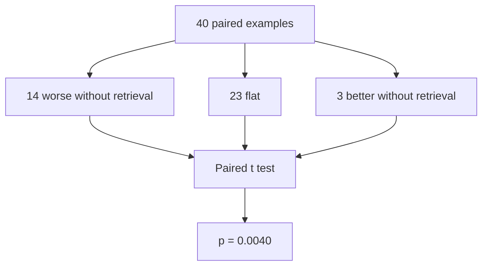

# Evaluation results

## Sample sizes, read this section first

Intent and escalation metrics use n equals two hundred, with template
drafts, since no LLM call is needed for those.

Reply quality and ablation metrics use n equals forty, real Groq drafts when
draft mode is set to llm, capped for cost and free tier token throughput
reasons.

The judge mode is heuristic: a rule based rubric, not an LLM acting as
judge. It still scores groundedness against the retrieved cases, and it
avoids a second API call per row.

Draft mode: llm. Workers: three, the default, chosen because Groq's free
tier allows roughly eight thousand tokens per minute, and higher
concurrency tends to trigger 429 rate limit errors.

## Comparison table

The intent and escalation columns use n equals two hundred. The judge mean
column uses n equals forty.

| System | Intent accuracy | Escalation precision | Escalation recall | Judge mean, scale of one to five |
|---|---|---|---|---|
| Trivial baseline | 12.5% | 0.0% | 0.0% | not applicable |
| Simple baseline | 100.0% | 100.0% | 2.6% | not applicable |
| Full system, with retrieval | 100.0% | 42.5% | 100.0% | 4.24, n = 40 |

## Retrieval ablation

The same forty messages are used in both arms. Intent and escalation results
are unchanged between arms. Only `draft_reply` loses access to historical
cases when reply context is set to none.

| Reply context | Judge mean | Helpfulness | Groundedness | Safety |
|---|---|---|---|---|
| With retrieval, n = 40 | 4.24 | 4.12 | 3.60 | 5.00 |
| Without retrieval, n = 40 | 3.99 | 3.75 | 3.23 | 5.00 |

### Groundedness paired check



Mean groundedness moved from 3.60 to 3.23, a change of 0.38, across n equals
forty. The standard deviation of the paired delta is 0.77. Broken down per
example, fourteen rows got worse without retrieval, twenty three stayed
flat, and three actually improved without retrieval. A paired t test between
the with and without conditions gives a p value of 0.0040.

Groundedness is the signal to trust for this ablation. The heuristic judge
still sees the retrieved cases regardless of whether the reply used them, so
a drop in groundedness without retrieval means the reply itself stopped
reflecting historical precedent. A small mean change on n equals forty could
be noise on its own, which is why the paired counts and the p value matter
more than the headline means alone.

## Efficiency notes

Intent and escalation are scored on the full golden set, since no LLM call
is required for that stage.

Reply quality and ablation use a sample, combined with concurrent Groq
calls when draft mode is llm. This is a sampling and concurrency choice, not
a change of model provider. The heuristic judge avoids a second LLM call per
row.

To run the full LLM pass on all two hundred rows across both ablation arms:
`PYTHONPATH=. python eval/run_eval.py --reply-sample 0 --workers 3`

## Reproduce

```bash
PYTHONPATH=. python eval/run_eval.py
PYTHONPATH=. python eval/run_eval.py --draft llm --reply-sample 40 --workers 3
```
